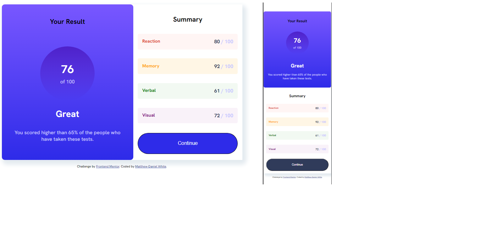

# Frontend Mentor - Results summary component solution

This is a solution to the [Results summary component challenge on Frontend Mentor](https://www.frontendmentor.io/challenges/results-summary-component-CE_K6s0maV). Frontend Mentor challenges help you improve your coding skills by building realistic projects.

## Table of contents

- [Overview](#overview)
  - [The challenge](#the-challenge)
  - [Screenshot](#screenshot)
  - [Links](#links)
- [My process](#my-process)
  - [Built with](#built-with)
  - [What I learned](#what-i-learned)
  - [Continued development](#continued-development)
  - [Useful resources](#useful-resources)
- [Author](#author)

**Note: Delete this note and update the table of contents based on what sections you keep.**

## Overview

### The challenge

Create a responsive results summary component according to the designs given.
Users should be able to:

- View the optimal layout for the interface depending on their device's screen size
- See hover and focus states for all interactive elements on the page

### Screenshot

### Links

- Solution URL: [Add solution URL here](https://github.com/PersianBlue)
- Live Site URL: [Add live site URL here](https://persianblue.github.io/results-summary-component-main/)

## My process

### Built with

- Semantic HTML5 markup
- Flexbox
- CSS Grid
- Mobile-first workflow

### What I learned

Using CSS grid to make it easier to design things responsively. It was especially useful for the results part.

### Continued development

I want to use CSS grid to make more complex layouts now as these have been pretty simple.

### Useful resources

- https://grid.malven.co/ - cheat sheet for css grid -https://www.youtube.com/watch?v=8QSqwbSztnA - Get Started with CSS Grid WITHOUT being overwhelmed - by Kevin Powell

## Author

- Website - [Matthew-Daniel White] (github.com/PersianBlue)
